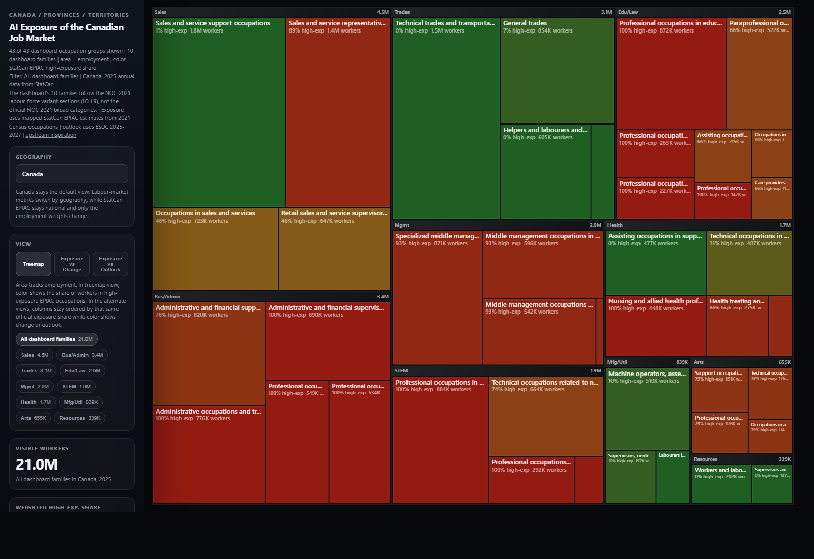

# AI Exposure of the Canadian Job Market

Analyzing how exposed Canadian occupation groups are to AI using official Statistics Canada, ESDC, and OaSIS sources.



## What's here

This repo combines four Canadian data sources:

- [14-10-0416-01](https://www150.statcan.gc.ca/t1/tbl1/en/tv.action?pid=1410041601) Labour force characteristics by occupation, annual
- [14-10-0417-01](https://www150.statcan.gc.ca/t1/tbl1/en/tv.action?pid=1410041701) Employee wages by occupation, annual
- [2025-2027 Employment Outlooks - NOC 2021](https://open.canada.ca/data/en/dataset/b0e112e9-cf53-4e79-8838-23cd98debe5b/resource/cb52e1d0-ab62-4357-91cc-d8f5a2114e02)
- [Occupational and Skills Information System (OaSIS) - 2025 Version 1.0](https://open.canada.ca/data/en/dataset/10ce43bd-fb58-4969-806b-4bffebc87bec)

AI exposure in the site build uses official StatCan EPIAC data from:

- [Experimental Estimates of Potential Artificial Intelligence Occupational Exposure in Canada, 2024](https://www150.statcan.gc.ca/n1/pub/11f0019m/11f0019m2024005-eng.htm)

That study reports AIOE, complementarity, and HELC/HEHC/low-exposure splits for published occupation groups based on the **2021 Census**. This repo uses the official **516 NOC 2021 unit groups** as the canonical occupation IDs, rolls them up through the official **45 major groups**, allocates annual labour metrics from the published StatCan occupation tables, and maps official EPIAC fields onto the canonical spine.

Context studies using the same framework:

- [StatCan, January 28, 2026: employment growth since the start of the generative AI era](https://www150.statcan.gc.ca/n1/en/pub/36-28-0001/2026001/article/00001-eng.pdf)
- [ISQ, February 3, 2026: Exposition des professions a l'intelligence artificielle en 2024](https://statistique.quebec.ca/fr/fichier/exposition-professions-intelligence-artificielle-2024.pdf)

## Data pipeline

1. `fetch_statcan.py`
   Downloads the StatCan occupation tables, discovers and caches the latest official OaSIS release, allocates the annual labour metrics onto the canonical 516 NOC 2021 unit groups using ESDC unit employment weights, and writes the canonical occupation outputs plus the OaSIS profile artifacts.
2. `build_site_data.py`
   Builds `site/data.json`, per-major-group `site/family-data/*.json` payloads, and dedicated `site/job-family-*.html` job-family routes from the canonical unit-group layer and the official 45 major-group rollups.
3. `make_prompt.py`
   Builds `prompt.md`, a single markdown summary of the Canadian dataset with official EPIAC fields.
4. `site/index.html`
   Interactive visualization where area = Canadian employment and color = EPIAC high-exposure share.

## Current architecture

- The active data pipeline is fully Canadian and uses official **StatCan / ESDC / OaSIS** sources.
- The dataset uses the official **516 Canadian NOC 2021 unit groups** as canonical IDs and the official **45 major groups** as the primary dashboard roll-up.
- Exposure is based on **official StatCan EPIAC / AIOE / complementarity** data.
- The dashboard mixes different reference periods intentionally:
  - exposure: mapped from the StatCan 2024 EPIAC study using **2021 Census** occupation data
  - employment and wages: latest StatCan annual tables through **2025**
  - outlook: province-aggregated ESDC outlook data for **2025-2027**
- The repo attaches the official **900 OaSIS occupational profiles** to the canonical spine through an explicit generated mapping table, preserving one-to-many cases where OaSIS is more granular than a unit group.

## Key files

| File | Description |
|------|-------------|
| `occupations.json` | Canonical NOC 2021 unit-group index with NOC codes and major-group metadata |
| `occupations.csv` | Canonical 516-unit-group labour, outlook, and EPIAC fields |
| `oasis.json` | Generated official OaSIS profile artifact with resolved release metadata, explicit canonical mappings, and audit reports |
| `oasis_profile_mappings.csv` | Flat explicit OaSIS profile-to-canonical-unit mapping table with one-to-one vs one-to-many cardinality |
| `prompt.md` | Single-file markdown summary of the Canadian dataset |
| `docs/noc-2021-taxonomy.md` | Canonical taxonomy and methodology note for the official NOC 2021 spine |
| `pages/` | Generated occupation summaries and source notes |
| `site/` | Static website, including dashboard, job-family routes, and generated family payloads |
| `epiac_data.py` | Official EPIAC source rows and mapping logic |
| `oasis_data.py` | Official OaSIS release discovery, caching, normalization, and mapping logic |
| `outlook_data.py` | ESDC outlook ingestion and aggregation logic |
| `archive/` | Clearly non-product archival history, not used by the build |

## Setup

```bash
uv sync
```

No API key is required for the current site build.

## Usage

```bash
# Download and build the Canadian occupation dataset
uv run python fetch_statcan.py

# Build website data
uv run python build_site_data.py

# Generate prompt.md
uv run python make_prompt.py

# Serve the site locally
cd site && python -m http.server 8000
```

## Notes

- The StatCan downloads are cached in `tmp/statcan/`.
- The latest official OaSIS package is cached in `tmp/oasis/` after `fetch_statcan.py` runs.
- `pages/` is generated output and can be recreated from `fetch_statcan.py`.
- The EPIAC mapping is an inference from the closest published StatCan occupation groups to the canonical NOC 2021 spine. Each generated row and page includes a mapping note.
- OaSIS mappings are explicit rather than inferred: `oasis_profile_mappings.csv` records every attached profile row, and `oasis.json` reports any unmapped or ambiguous profiles.
- `archive/` is preserved as non-product history and is not imported by the active build or shipped site.

## Backlog

See [BACKLOG.md](BACKLOG.md) for the current implementation backlog.
